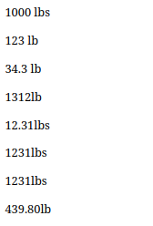
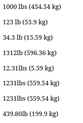

A simple little firefox extension made for learning purposes. The extension is super simple and should not be used as a real extension.

The extension transforms units in pounds (lb) to kilograms (kg).

This simple html:

transforms into this:

References:

- https://developer.mozilla.org/en-US/docs/Mozilla/Add-ons/WebExtensions/Your_first_WebExtension
- https://developer.mozilla.org/en-US/docs/Mozilla/Add-ons/WebExtensions/Your_second_WebExtension
- https://github.com/mdn/webextensions-examples/tree/main/emoji-substitution
